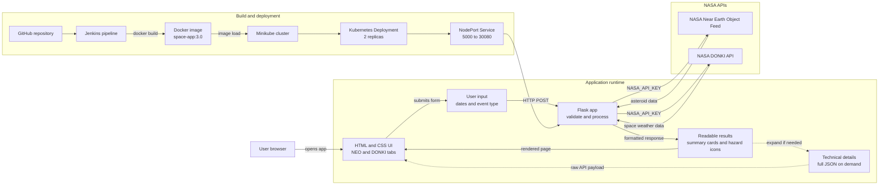

# NASA Space Data Application

A Flask web application for exploring NASA space data through two public APIs:

- **Near Earth Object Feed:** Find asteroids making close approaches to Earth and identify potentially hazardous asteroids.
- **DONKI:** Search NASA's Space Weather Database Of Notifications, Knowledge, Information (DONKI) for major space weather activity.

**The project also includes Docker, Jenkins, and Kubernetes/Minikube deployment configuration.**

## Architecture



The user selects a date range and, for DONKI, an event category. Flask validates that input, calls the selected NASA API with `NASA_API_KEY`, and formats the response into readable result cards. NEO results include hazardous-asteroid indicators, while DONKI results include important event facts with the complete JSON payload available under technical details. For Kubernetes deployments, Minikube runs two Flask replicas behind the `space-app-service` NodePort service. Jenkins builds the Docker image from the `main` branch.

## Features

- Separate Near Earth Objects and DONKI tabs
- Date-based NASA API searches
- Warning icons for potentially hazardous asteroids
- Readable DONKI event summaries with technical JSON available on demand
- Loading feedback while searches are submitted
- Transient DONKI service-error retries
- Docker container support on port `5000`
- Kubernetes deployment with two replicas and a NodePort service
- Jenkins pipeline for building the Docker image

## Requirements

- Python 3.12 or later
- A NASA API key from the [NASA API portal](https://api.nasa.gov/)
- Docker Desktop for container builds
- Optional: Jenkins, kubectl, and Minikube for CI/CD and Kubernetes deployment

## Configuration

Create a `.env` file in the project root:

```env
NASA_API_KEY=your_nasa_api_key
```

Never commit `.env` or publish your API key. The repository ignores `.env` by default.

## Run Locally

Create and activate a virtual environment on Windows PowerShell:

```powershell
python -m venv .venv
.\.venv\Scripts\Activate.ps1
pip install -r requirements.txt
python app.py
```

Open [http://localhost:5000](http://localhost:5000).

The Flask application listens on `0.0.0.0:5000`, which allows it to work both locally and inside containers.

## Run with Docker

Build the image:

```powershell
docker build -t space-app:3.0 .
```

Run the container using the local `.env` file:

```powershell
docker run -d --name space-app -p 5000:5000 --env-file .env space-app:3.0
```

Open [http://localhost:5000](http://localhost:5000).

Useful commands:

```powershell
docker logs space-app
docker ps
docker stop space-app
docker rm space-app
```

## Jenkins

The repository contains a `Jenkinsfile` for a Windows Jenkins agent. It builds the Docker image with the tag `space-app:3.0`.

Configure the Jenkins pipeline with:

- Repository: `https://github.com/HarshithaDA/NASA-Space-Data-App`
- Branch: `*/main`
- Script path: `Jenkinsfile`

The Jenkins agent must have Docker available, and the pipeline uses the Windows `bat` step.

## Kubernetes with Minikube

Start Minikube:

```powershell
minikube start --driver=docker
```

Build the image and make it available to Minikube:

```powershell
docker build -t space-app:3.0 .
minikube image load space-app:3.0
```

Apply the deployment and service:

```powershell
kubectl apply -f kubernetes/deployment.yaml
kubectl apply -f kubernetes/service.yaml
```

Check the deployment:

```powershell
kubectl get pods
kubectl get service space-app-service
kubectl rollout status deployment/space-app
```

Open the service through Minikube:

```powershell
minikube service space-app-service --url
```

Open the URL printed by Minikube and keep that terminal open while using the application. With the Docker driver on Windows, Minikube creates a temporary tunnel.

An alternative is port forwarding:

```powershell
kubectl port-forward service/space-app-service 5000:5000
```

Then open [http://localhost:5000](http://localhost:5000).

If the deployment uses a newly built image tag, update it with:

```powershell
kubectl set image deployment/space-app space-app=space-app:3.0
kubectl rollout restart deployment/space-app
kubectl rollout status deployment/space-app
```

## Project Structure

```text
.
├── app.py                  Flask application and NASA API integration
├── templates/index.html    Main web page
├── static/style.css        Application styling
├── Dockerfile              Container image definition
├── Jenkinsfile             Jenkins Docker build pipeline
├── kubernetes/
│   ├── deployment.yaml     Two-replica Kubernetes deployment
│   └── service.yaml        NodePort service on port 30080
├── requirements.txt        Python dependencies
└── .env.example            Environment variable template
```

## Troubleshooting

### Page is not reachable in Docker or Kubernetes

Confirm that Flask is listening on all interfaces:

```text
Running on all addresses (0.0.0.0)
```

Check container or Kubernetes logs:

```powershell
docker logs space-app
kubectl logs deployment/space-app
```

### DONKI returns HTTP 503

NASA's DONKI service can be temporarily unavailable. The app retries transient `502`, `503`, and `504` responses. Wait briefly and submit the search again.

### Jenkins cannot find the pipeline

The file must be named exactly `Jenkinsfile`, not `Jenkinsfile.txt`, and it must exist in the branch configured in Jenkins.
